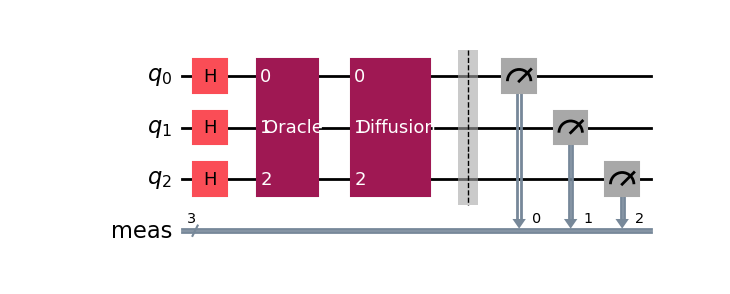
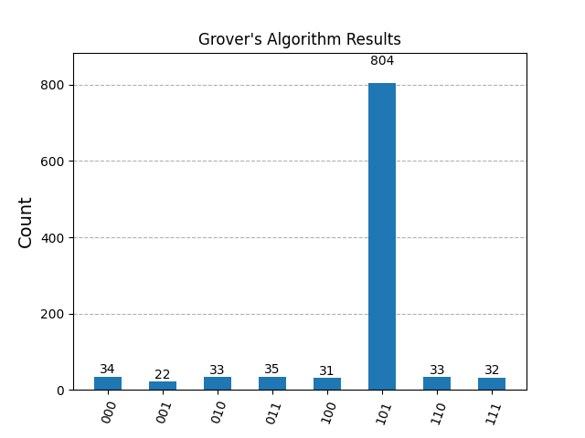

# Project 3: Grover's Algorithm

## Objective
Implement and understand Grover's search algorithm.

## Ovreview
Learn the principles behind Grover's algorithm, implement it using Qiskit, and analyze the efficiency of this quantum search algorithm.

## Getting Started
- Ensure that the necessary packages have been installed as outlined in the main repository README.

## Key Concepts

### Understanding Grover's Algorithm
Grover's Algorithm is designed for searching an unsorted database or an unstructured list of N items in O(√N) time, providing a quadratic speedup over classical algorithms.

The algorithm involves three main steps:
- **Initialization**: Prepare the qubits in an equal superposition state.
- **Oracle Application**: Apply a quantum oracle that marks the solution by flipping the phase of the target state.
- **Amplitude Amplification**: Amplify the probability amplitude of the target state using the Grover diffusion operator.

## Experiment Setup
1. **Initialization**:
   - We start by initializing 3 qubits in a superposition state using Hadamard gates. This prepares the qubits in an equal probability of all possible states (from |000⟩ to |111⟩).

2. **Oracle**:
   - An oracle is implemented that flips the phase of the target state (binary 101 in this case). This is done by applying X gates to qubits where the target state has a 0, applying a multi-controlled Z gate, and then reverting the X gates.

3. **Diffusion Operator**:
   - The diffusion operator amplifies the probability amplitude of the target state. This involves applying Hadamard gates, X gates, a multi-controlled Z gate, and then reverting the X and Hadamard gates.

4. **Measurement**:
   - After applying the oracle and diffusion operator, we measure the qubits to collapse their states. The target state should have a significantly higher probability of being measured.



### Database Representation
In this experiment, the database is conceptually represented by all possible states of 3 qubits. The possible states (entries in the database) are:

- **Number of Entries**: 8 possible states
- **Entries**: |000⟩, |001⟩, |010⟩, |011⟩, |100⟩, |101⟩, |110⟩, |111⟩
- **Target Entry**: |101⟩, corresponding to the decimal number 5

### Data Used
- **Number of Qubits**: 3
- **Target State**: 5 (binary 101)
- **Number of Shots**: 1024

### Expected Outcome
Grover's algorithm should significantly increase the probability of measuring the target state (101) compared to other states.

## Actual Results from the Experiment

```plaintext
Results of Grover's Algorithm:
{'101': 804, '000': 34, '001': 22, '011': 35, '111': 32, '110': 33, '010': 33, '100': 31}
```



### Target State |101⟩
The target state 101 (binary for 5) was measured 804 times out of 1024 shots. This high count indicates that Grover's algorithm successfully amplified the probability amplitude of the target state.

### Other States
The other states (|000⟩, |001⟩, |011⟩, |111⟩, |110⟩, |010⟩, |100⟩) have much lower counts, ranging between 22 and 35. This demonstrates that their probability amplitudes were not significantly amplified and remained relatively low.

### Analysis
The results clearly show the effectiveness of Grover's algorithm:
- The target state 101 dominates the measurement outcomes, verifying the quadratic speedup in search efficiency.
- The significantly higher count for the target state compared to the other states validates the principle of Grover's algorithm, which is to increase the probability of the correct state being measured while reducing the probabilities of the incorrect states.

## Real-World Application of Grover's Algorithm: Searching an Unsorted Database

Imagine you work for a large company that maintains an extensive unsorted database of customer records. Each record is identified by a unique customer ID. Your task is to find the record of a specific customer based on their ID. In a classical approach, you would need to check each record one by one until you find the target, resulting in an average time complexity of \(O(N)\), where \(N\) is the total number of records.

### Applying Grover's Algorithm

Using Grover's Algorithm, the search time can be significantly reduced to \(O(\sqrt{N})\), providing a substantial speedup for large databases. Here’s how Grover's Algorithm can be applied:

1. **Database Representation**:
   - Consider the database has \(N = 1,000,000\) records.
   - Each record is represented by a unique binary identifier (e.g., a 20-bit binary number since \(2^{20} = 1,048,576\)).

2. **Initialization**:
   - Initialize 20 qubits in a superposition state using Hadamard gates. This creates a superposition of all possible 20-bit binary numbers, representing all possible customer IDs in the database.

3. **Oracle Application**:
   - Implement an oracle that flips the phase of the qubit state corresponding to the target customer ID. The oracle function checks if the current qubit state matches the target ID and marks it by inverting its phase.

4. **Amplitude Amplification**:
   - Apply the Grover diffusion operator to amplify the probability amplitude of the target customer ID. This increases the likelihood of measuring the target state upon observation.

5. **Measurement**:
   - Measure the qubits after a sufficient number of iterations (approximately \(\sqrt{N}\) iterations) to collapse their state. The target customer ID will have a significantly higher probability of being observed.

### Results and Benefits

By using Grover's Algorithm, you can find the target customer ID in approximately \(\sqrt{1,000,000} = 1,000\) steps, compared to an average of 500,000 steps using a classical search method. This quadratic speedup demonstrates the power of quantum computing for search problems and highlights its potential to revolutionize tasks that involve large-scale data processing and retrieval.

### Conclusion

Grover's Algorithm provides a quantum approach to searching unsorted databases more efficiently than classical methods. This example illustrates its potential application in a real-world scenario, showcasing how quantum computing can offer significant improvements in solving specific types of computational problems.

